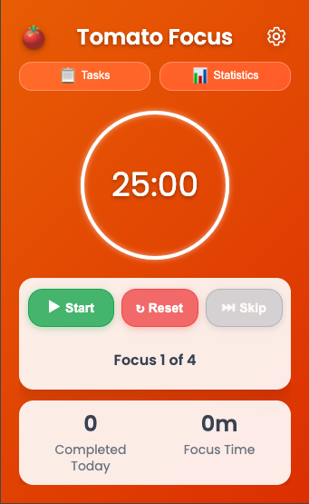
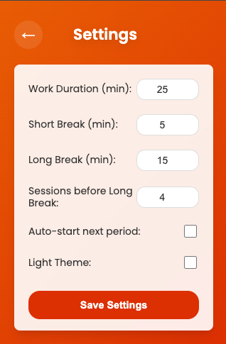

# 🍅 Focus Timer – A Chrome Extension for Productivity

A configurable **time-management Chrome extension** that helps boost productivity by using a method inspired by the Pomodoro® Technique. This extension provides a beautiful, intuitive interface with customizable timing, notifications, and visual feedback to help you maintain focus during work sessions and ensure you take proper breaks.

  
  

> **Disclaimer**: This project is **not affiliated with**, **endorsed by**, or **licensed by** Francesco Cirillo or the official Pomodoro® Technique. “Pomodoro®” is a registered trademark of Francesco Cirillo.  
> Learn more at [https://www.pomodorotechnique.com](https://www.pomodorotechnique.com)

Stay focused and take healthy breaks! 🍅⏰

## Features

### 🧭 Core Timer Functionality
- **Work Sessions**: Default 25-minute focused work periods
- **Short Breaks**: 5-minute breaks between sessions
- **Long Breaks**: 15-minute extended breaks after a configurable number of sessions
- **Visual Progress**: Circular progress ring with smooth countdown animation
- **Session Counter**: Track your completed focus sessions

### ⚙️ Customizable Settings
- **Flexible Durations**: Adjust work, short break, and long break durations (1–60 minutes)
- **Break Intervals**: Configure how many sessions before a long break (1–10)
- **Auto-Start**: Automatically start the next period
- **Theme Options**: Light and dark mode
- **Persistent Settings**: Preferences are saved and restored between sessions

### 🔔 Smart Notifications
- **Browser Alerts**: Notifications when sessions end
- **Cross-Platform Support**: macOS, Windows, Linux
- **Permission Hints**: Built-in help for enabling notifications

### 🚀 Advanced Features
- **Badge Display**: See time remaining on the extension icon
- **Context Menu Actions**: Quick access through right-click
- **Quick Timers**: Launch 5/15/25/45 min timers instantly
- **Skip Break**: Flexibility when needed
- **Session Persistence**: Survives browser restarts

### 🎨 Modern Interface
- **Clean Design**: Minimalist UI with smooth transitions
- **Responsive Layout**: Optimized for popup use
- **Visual Feedback**: Different colors for focus vs. break
- **Custom Icons**: Tomato-inspired visuals that change with session type

## Installation

### From Chrome Web Store (coming soon)
_Not yet published._

### Manual Installation (Development)
1. Clone or download this repository
2. Open `chrome://extensions/` in Chrome
3. Enable "Developer mode"
4. Click **Load unpacked** and select the extension folder

## Usage

### Basic Operation
1. **Start Timer**: Click the extension icon and press "Start"
2. **Pause/Resume**: Use the pause or resume controls
3. **Reset**: Restart the current session
4. **Break Management**: Skip or complete breaks as needed

### Settings Configuration
1. Click the gear icon in the popup
2. Adjust:
   - Work, short break, and long break durations
   - Sessions before a long break
   - Auto-start toggle
   - Theme preference
3. Click "Save Settings" to apply

### Context Menu Features
Right-click the extension icon to:
- Start/Pause
- Reset
- Skip Break
- Quick Start (5/15/25/45 min)

### Notifications Setup

#### macOS
- Go to System Preferences → Notifications
- Enable notifications for Google Chrome

#### Windows/Linux
- Check your system notification settings
- Allow Chrome notifications

## Technical Details

- **Browser Compatibility**: Chrome, Edge, and other Chromium-based browsers
- **Permissions**:
  - `notifications`: For timer alerts
  - `storage`: To persist user settings
  - `contextMenus`: For right-click controls
- **Architecture**:
  - Manifest V3
  - Service Worker
  - Popup UI
  - Chrome Storage API

## Development

### Building and Testing
1. Make changes to the source files
2. Reload the extension in `chrome://extensions/`
3. Test functionality by clicking the extension icon
4. Check the background script console for any errors
5. Verify notifications work correctly

### Contributing
1. Fork the repository
2. Create a feature branch: `git checkout -b feature-name`
3. Make your changes and test thoroughly
4. Commit with descriptive messages
5. Push to your fork and submit a pull request

## Acknowledgments
- Inspired by the timeboxing method popularized as the Pomodoro® Technique
- Icons inspired by traditional tomato timers

## Support
Please report issues or suggestions via [Github Issues](https://github.com/richardsd/pomodoro-chrome-extension/issues).

## License
This project is licensed under the [GNU GPL v3.0](https://www.gnu.org/licenses/gpl-3.0.html).
