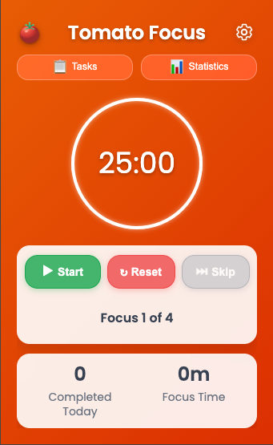
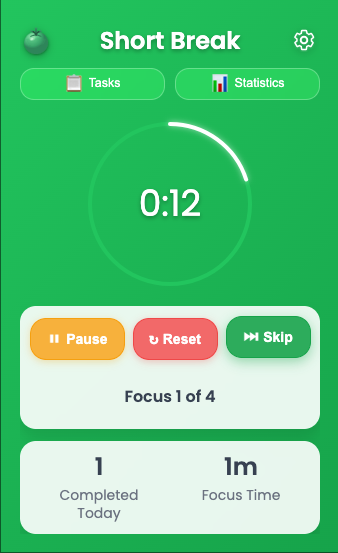
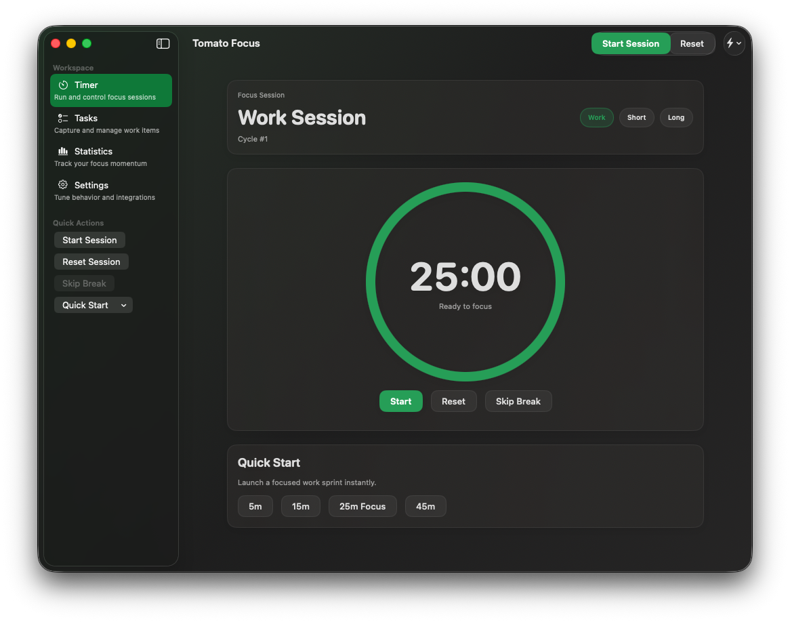
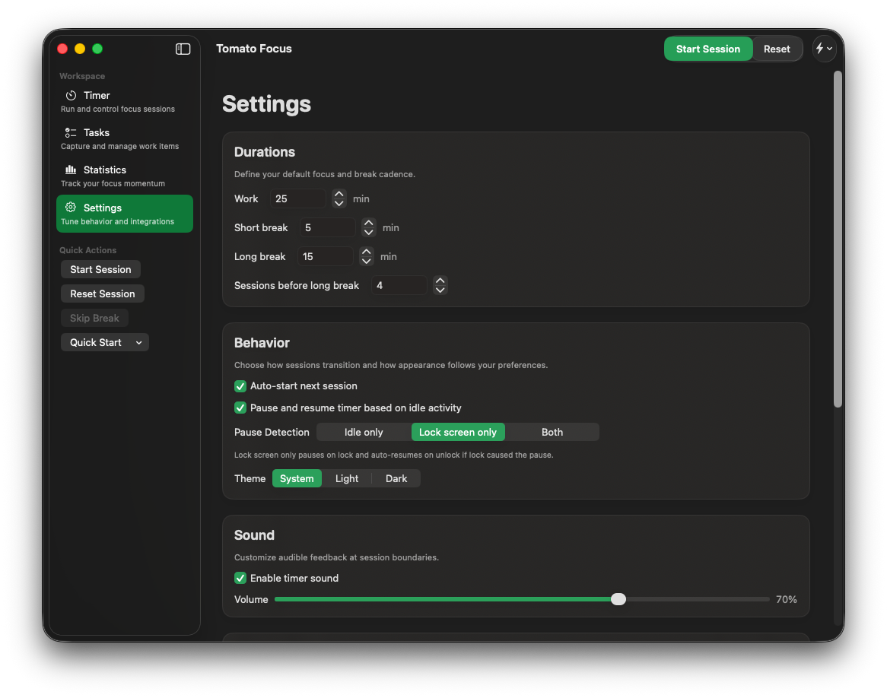
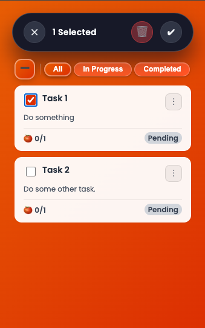
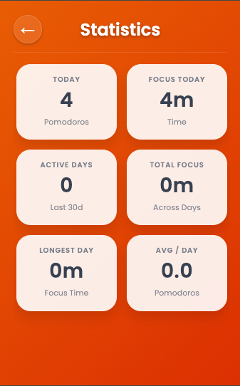
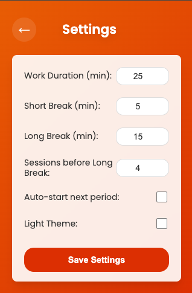

# 🍅 Tomato Focus – Productivity Tools for Chrome + macOS

A configurable **time-management toolkit** inspired by the Pomodoro® Technique. This repository currently includes:

- a **Chrome extension** (primary shipped experience), and
- a **native macOS app** (SwiftUI modular app scaffold in `macos-app/`).

Both experiences focus on customizable timing, notifications, task management, and visual feedback to help you maintain focus during work sessions and ensure you take proper breaks.

<p align="center">
  
  
</p>

> **Disclaimer**: This project is **not affiliated with**, **endorsed by**, or **licensed by** Francesco Cirillo or the official Pomodoro® Technique. “Pomodoro®” is a registered trademark of Francesco Cirillo.
> Learn more at [https://www.pomodorotechnique.com](https://www.pomodorotechnique.com)

Stay focused and take healthy breaks! 🍅⏰

## Quick Start

1. Install the extension (see [Installation](#installation)).
2. Click the Tomato Focus icon and press **Start** to begin a session.
3. Track or select a task from the task list to stay organized.
4. Open **Settings** to customize durations, themes, and notifications.

## Table of Contents

- [Quick Start](#quick-start)
- [Projects in this Repository](#projects-in-this-repository)
- [What's New](#whats-new)
- [Features](#features)
- [Installation](#installation)
- [Usage](#usage)
- [Technical Details](#technical-details)
- [Development](#development)
- [Privacy Policy](#privacy-policy)
- [Acknowledgments](#acknowledgments)
- [Support](#support)
- [License](#license)

## Projects in this Repository

### 1) Chrome Extension
- Main browser-based experience.
- Source and assets live in the repository root (`manifest.json`, `src/`, `popup.html`, etc.).

### 2) macOS App
- Native SwiftUI app scaffold located at [`macos-app/`](macos-app/).
- Includes modular targets for timer, tasks, statistics, settings, Jira integration, and platform services.
- Open in Xcode with:
  ```bash
  open macos-app/TomatoFocusMacApp.xcodeproj
  ```
- For more details, see [`macos-app/README.md`](macos-app/README.md).

<p align="center">
  
  
</p>

## Features

### 🧭 Core Timer Functionality
- **Work Sessions**: Default 25-minute focused work periods
- **Short Breaks**: 5-minute breaks between sessions
- **Long Breaks**: 15-minute extended breaks after a configurable number of sessions
- **Visual Progress**: Circular progress ring with smooth countdown animation
- **Session Counter**: Track your completed focus sessions

### 📋 Task Management
- **Task List**: Create, edit, and delete tasks to organize your work
- **Task-Timer Integration**: Associate your Pomodoro sessions with specific tasks
- **Progress Tracking**: See how many Pomodoros each task has consumed vs estimated
- **Current Task Display**: Shows your active task right on the timer screen
- **Quick Toggle**: Click the target (🎯) icon again to unset the current task
- **Task Statistics**: Enhanced analytics showing task-based productivity metrics
- **Task Filters**: View All, In Progress, or Completed tasks
- **Clear Completed Tasks**: Remove all finished tasks in one click
- **Jira Sync**: Import assignments on demand or enable automatic refreshes on a custom schedule

<p align="center">
  
</p>

### 📊 Statistics Panel
- **Daily Summary**: Displays today's completed sessions and total focus time
- **Data Management**: Option to clear all stored statistics

<p align="center">
  
</p>

### ⚙️ Customizable Settings
- **Flexible Durations**: Adjust work, short break, and long break durations (1–60 minutes)
- **Break Intervals**: Configure how many sessions before a long break (1–10)
- **Auto-Start**: Automatically start the next period
- **Theme Options**: Light and dark mode
- **Play Sound & Volume**: Enable/disable notification sounds and control volume
- **Pause When Idle**: Automatically pause (and optionally resume) when the system is idle or locked
- **Persistent Settings**: Preferences are saved and restored between sessions
- **Jira Credentials**: Store Jira connection details securely in extension storage (Jira Cloud)

<p align="center">
  
</p>

### 🔔 Smart Notifications
- **Browser Alerts**: Notifications when sessions end
- **Cross-Platform Support**: macOS, Windows, Linux
- **Permission Hints**: Built-in help for enabling notifications
- **Offscreen Audio**: Uses a hidden document to reliably play notification sounds
- **Inline Feedback**: Popup toasts confirm Jira sync results or alert you when something goes wrong

### 🚀 Advanced Features
- **Badge Display**: See time remaining on the extension icon
- **Context Menu Actions**: Quick access through right-click
- **Quick Timers**: Launch 5/15/25/45 min timers instantly
- **Skip Break**: Flexibility when needed
- **Session Persistence**: Survives browser restarts
- **Idle Detection**: Monitors system state to pause and resume the timer automatically

### 🎨 Modern Interface
- **Clean Design**: Minimalist UI with smooth transitions
- **Responsive Layout**: Optimized for popup use
- **Visual Feedback**: Different colors for focus vs. break
- **Custom Icons**: Tomato-inspired visuals that change with session type

## Installation

### macOS App (Native)
1. Ensure Xcode is installed
2. Open the project:
   ```bash
   open macos-app/TomatoFocusMacApp.xcodeproj
   ```
3. Build and run the `TomatoFocusMacAppApp` scheme in Xcode
4. (Optional) Build from terminal:
   ```bash
   swift build --package-path macos-app
   swift run --package-path macos-app TomatoFocus
   ```

### From Chrome Web Store (coming soon)
_Not yet published. A link will be added once the listing is live._

### Manual Installation (Development)
1. Clone or download this repository
2. Open `chrome://extensions/` in Chrome
3. Enable "Developer mode"
4. Click **Load unpacked** and select the extension folder
5. For Edge, open `edge://extensions/` and follow the same steps

## Usage

### Basic Operation
1. **Start Timer**: Click the extension icon and press "Start"
2. **Pause/Resume**: Use the pause or resume controls
3. **Reset**: Restart the current session
4. **Break Management**: Skip or complete breaks as needed

### Settings Configuration
1. Click the gear icon in the popup
2. Adjust:
   - Work, short break, and long break durations
   - Sessions before a long break
   - Auto-start toggle
   - Theme preference
   - Jira credentials, one-time sync, and optional periodic Jira syncing (interval in minutes)
3. Click "Save Settings" to apply

### Context Menu Features
Right-click the extension icon to:
- Start/Pause
- Reset
- Skip Break
- Quick Start (5/15/25/45 min)

### Notifications Setup

#### macOS
- Go to System Preferences → Notifications
- Enable notifications for Google Chrome

#### Windows/Linux
- Check your system notification settings
- Allow Chrome notifications

## Technical Details

### Product Targets
- **Chrome Extension**: Chromium browser extension (Manifest V3)
- **macOS App**: SwiftUI app scaffold (Swift Package Manager + Xcode project)

- **Browser Compatibility**: Chrome, Edge, and other Chromium-based browsers
- **Permissions (with rationale)**:
  - `notifications`: Show timer and break alerts.
  - `storage`: Save your timer settings and preferences.
  - `contextMenus`: Add right-click controls for quick actions.
  - `alarms`: Schedule timer ticks and break reminders in the background.
  - `idle`: Pause or adjust timers when the system is idle.
  - `offscreen`: Play notification sounds via an offscreen document.
  - `*://*/*` (host permissions): Allow optional site-level focus features across any page you use (required for Jira sync).
- **Architecture**:
  - Manifest V3
  - Service Worker
  - Popup UI
  - Chrome Storage API

### macOS App Architecture (high level)
- Modular packages under `macos-app/Sources` (for example: `AppShell`, `TimerFeature`, `TasksFeature`, `StatisticsFeature`, `SettingsFeature`, `JiraIntegration`, `PlatformServices`, and `CoreInterfaces`)
- Dependency injection is handled by `CoreDI/AppContainer.swift`

## Development

### Setup
1. Clone the repository
2. Install dependencies: `npm install`
3. Enable developer mode in Chrome at `chrome://extensions/`
4. Load the unpacked extension

### macOS Development
- Open `macos-app/TomatoFocusMacApp.xcodeproj` in Xcode for app-level development.
- Or use SwiftPM commands from repo root:
  - `swift build --package-path macos-app`
  - `swift run --package-path macos-app TomatoFocus`

### Code Quality
This project uses a combination of ESLint, Stylelint, and Prettier for code quality and consistency:
- **Configuration**: `eslint.config.js`, `.stylelintrc`, and `.prettierrc`
- **Run linting**: `npm run lint` to check JavaScript, HTML, and CSS files
- **Auto-fix issues**: `npm run lint:fix`
- **Format code**: `npm run format` (or verify with `npm run format:check`)
- **Offline support**: Linting and formatting scripts bundle local fallbacks for required plugins so they can run without internet access.
- **IDE Integration**: Install ESLint, Stylelint, and Prettier extensions for real-time feedback

### Coding Standards
- **Indentation**: 4 spaces (enforced by EditorConfig and ESLint)
- **Line endings**: LF (Unix-style)
- **Quotes**: Single quotes for JavaScript
- **Semicolons**: Required
- **Chrome APIs**: `chrome` global is pre-configured

### Building and Testing
1. Make changes to the source files
2. Reload the extension in `chrome://extensions/`
3. Test functionality by clicking the extension icon
4. Check the background script console for any errors
5. Verify notifications work correctly

### Testing
There are no automated tests beyond linting at this time. Use `npm test` (or `npm run lint`) to run the linting and formatting checks. Always run `npm run lint` before submitting changes.

### Contributing
1. Fork the repository
2. Create a feature branch: `git checkout -b feature-name`
3. Make your changes and test thoroughly (always run `npm run lint`)
4. Commit with descriptive messages
5. Push to your fork and submit a pull request

## Privacy Policy

For details about what data is stored, where it is stored, and how to remove it,
see [PRIVACY_POLICY.md](PRIVACY_POLICY.md).

## Acknowledgments
- Inspired by the timeboxing method popularized as the Pomodoro® Technique
- Icons inspired by traditional tomato timers

## Support
Please report issues or suggestions via [GitHub Issues](https://github.com/richardsd/tomato-focus-chrome-extension/issues).

## License
This project is licensed under the [GNU GPL v3.0](https://www.gnu.org/licenses/gpl-3.0.html).
